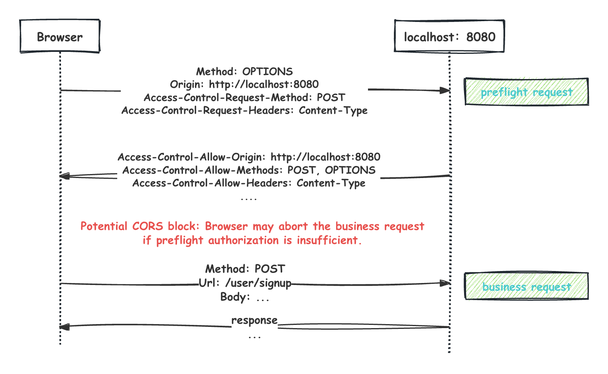

# Connectify Concept Guides

A collection of tutorials and diagrams to help you understand the core concepts and architecture of the project.

## 📂 Table of Contents
- [Web Security: CORS](#-web-security-cors)
- [Core Architecture: Middleware](#-core-architecture-middleware)

---

## 🟢 Web Security: CORS
Understanding how we handle cross-origin resource sharing.

### Key Points:
- **Preflight Request**: The browser sends an `OPTIONS` request first to check permissions.
- **Allowed Origins**: We explicitly define which websites (like `localhost:3000`) can talk to our server.
- **Headers**: Special headers are exchanged to grant access.

---

## 🟢 Core Architecture: Middleware
Understanding the "Onion Model" of our request processing pipeline.

### The Layered Approach:
- **Request Entry**: Every request enters through the outer layers (Logger, Recovery).
- **Processing**: It passes through security checks (CORS, Auth).
- **Business Logic**: Finally, it reaches the core handler.
- **Response**: The response travels back through the same layers.

---

